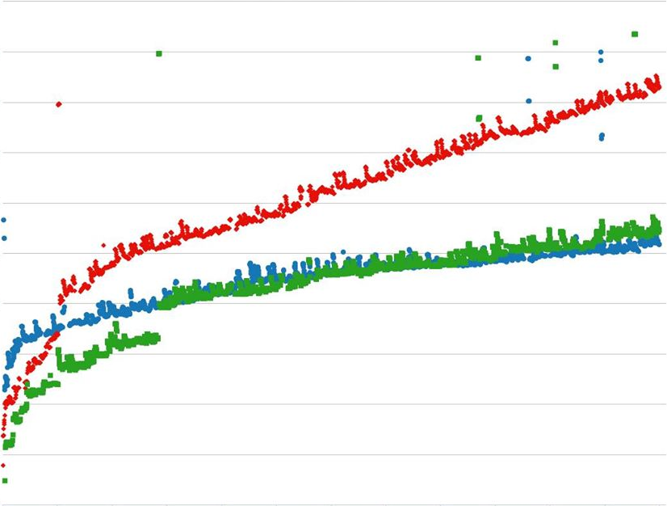

# Copy-on-write友好的Python垃圾回收（正在翻译）

原文链接：[Copy-on-write friendly Python garbage collection - Instagram Engineering](https://instagram-engineering.com/copy-on-write-friendly-python-garbage-collection-ad6ed5233ddf)

在Instagram，我们部署着全世界最大的Django web框架，它全部是用Python开发的。我们原先使用python只是因为它的简洁性，但是这些年随着规模的扩大我们不得不对它使用一点黑魔法来保证它的简洁。去年我们试过[取消python的垃圾回收]机制（重新分配内存同时回收没有使用的数据），获取了10%的性能提升。然而，随着我们开发队伍和产品特性的增长，使用的内存也随着增长。最终，取消垃圾回收失效了。

这里有张图表显示了随着请求的次数增多内存是如何增长的。当超过3000次请求的时候，每个进程占用了约600MB的内存。更为重要的是，这种趋势是线性的。


根据我们的负载测试，内存使用成为了瓶颈。使用垃圾回收可以缓解问题和减慢内存占用的增长，但是Copy-on-write(COW)这种不希望的特性仍会增加整个内存占用量。所以我们想看看使用Python的垃圾回收但是关闭COW会发生什么，很显然，内存使用量爆炸。

<center>
    
    红色：没有GC；蓝色： 显式使用GC；绿色：默认GC
</center>

# 第一次尝试：重新实现垃圾回收的头部数据结构

如果你仔细阅读过我们之前的文章，你会注意到COW的在Python对象之前：
```C
/* GC information is stored BEFORE the object structure. */
typedef union _gc_head 
{
    struct {
        union _gc_head *gc_next;
        union _gc_head *gc_prev;
        Py_ssize_t gc_refs;
    } gc;
    long double dummy; /* force worst-case alignment */
} PyGC_Head;
```