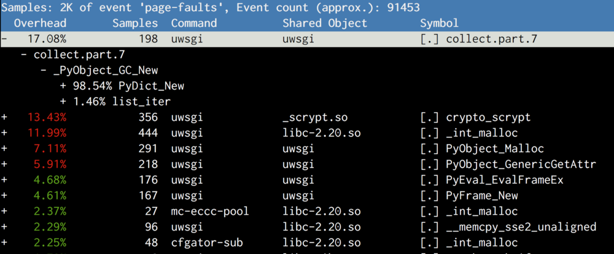
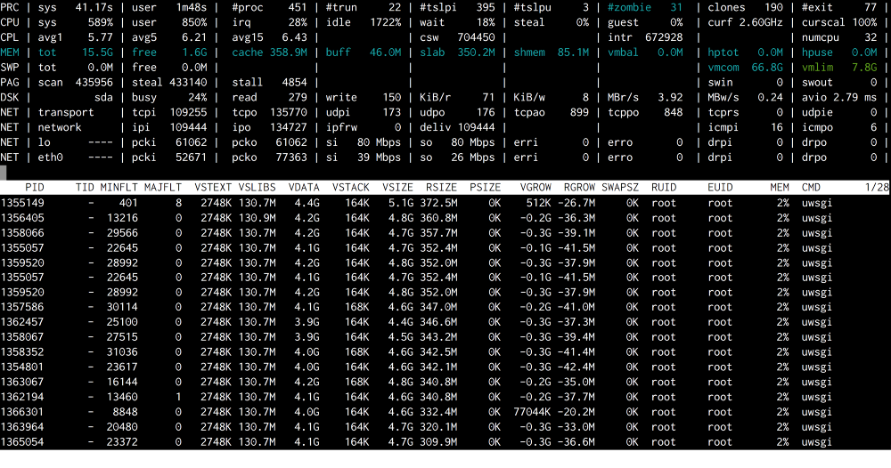
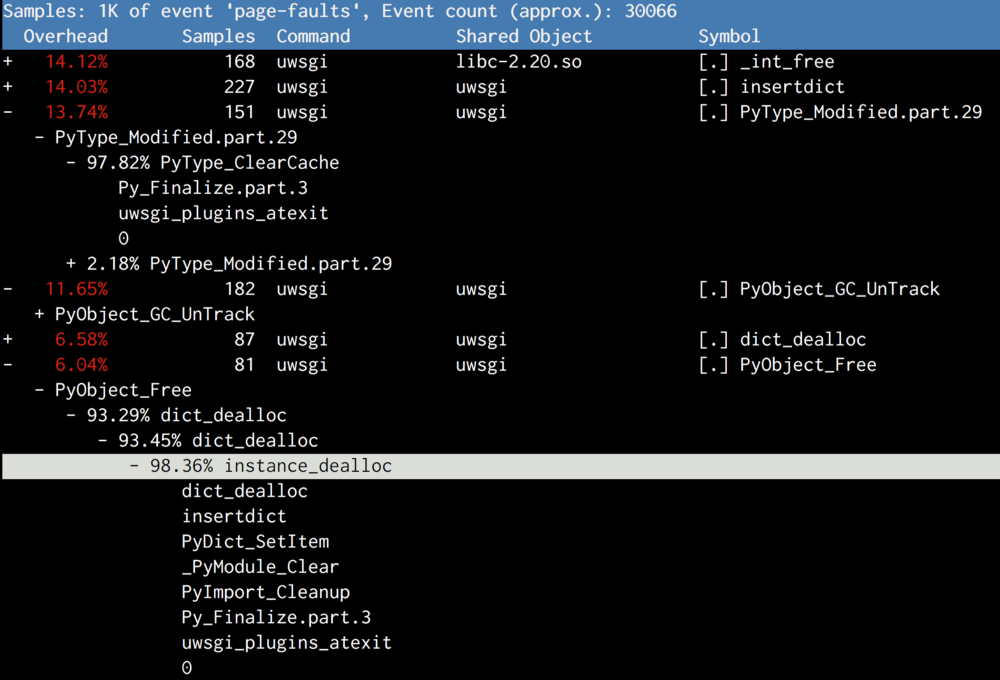

# 在Instagram，我们取消了Python垃圾回收

通过取消Python通过收集和清理无用数据来回收内存的这种垃圾回收机制，Instagram可以提高10%的性能。是的，你没有听错。通过取消GC，我们能够减少内存使用，提高CPU的LLC[^1]缓存的命中率。如果你想搞清楚为什么，那就继续往下阅读吧！

## 我们如何运行web服务器

Instagram的web服务器是以多进程的模式来运行Django应用的。一个主进程通过不断的fork它自己产生的数十个工作进程来处理达到的用户请求。我们使用uWSGI的prefork模式来复用主进程和工作进程之间共享的内存。

为了防止Django服务器内存溢出，uWSGI的主进程将重启那些RSS[^2]超过限制的工作进程。

## 理解内存

我们以搞清楚为什么工作进程的RSS会在它被主进程创建之后快速增长开始。我们观察到：尽管工作进程在刚开始有250MB的RSS，但是它和主进程之间的共享内存却很快的在几秒之内减少到140MB（共享内存可以通过`/proc/PID/smaps`查看）。RSS具体的大小并不需要注意，因为它会不断变化，但是共享内存的大量减少（将近三分之一）却很值得注意。下一步我们想要搞明白为什么每个进程在被创建不就之后这些共享内存会变成私有内存。

## 我们的理论：Copy-on-Read

Linux内核有一个Copy-on-Write（COW）的机制来优化用fork方式创建的进程。子进程刚被创建的时候会共享父进程内存的每一页。当共享的内存页被修改的时候，会被复制到子进程的内存空间（细节见wiki https://en.wikipedia.org/wiki/Copy-on-write）。

但是在Python中，因为引用计数，事情变得复杂起来了。每当我们读取一个Python对象，解释器将会增加Python对象的引用计数，这将最终对底层的数据结构进行一次写操作。这样就引起了COW。所以在Python中，我们正在执行Copy-on-Read（CoR）！


```c
#define PyObject_HEAD                   \
    _PyObject_HEAD_EXTRA                \
    Py_ssize_t ob_refcnt;               \
    struct _typeobject *ob_type;
...
typedef struct _object {
    PyObject_HEAD
} PyObject;
```


那么现在的问题是：对于不可改变的对象，比如code objects也是执行的copy-on-write？很显然`PyCodeObject`确实是`PyObject`的子类。我们第一个想法是关闭`PyCodeObject`的引用计数。

## 第一次尝试：关闭code objects的引用计数

在Instagram，我们总是从简单的事开始做起。将这种尝试当做一次试验，我们稍微“黑”了一下CPython的解释器，用来确认code object的引用计数不会改变，同时将“黑”过的CPython解释器部署到一台生产服务器上。

结果很令人失望，因为共享的内存没有任何改变。当我们尝试弄清楚原因时，我们意识到我们不仅没有一个可靠的指标来证明我们的方法是否有效，也没有能够证明共享的内存和复制code objects有联系。很显然，我们遗漏了什么。学习了一课：做之前先证明你的理论。


## 页错误剖析

当google Copy-on-Write后，我们学习到在操作系统中Copy-on-Write是和页错误联系在一起的。每一次CoW会在进程中触发一次页错误。Linux的Perf工具可以记录硬件/软件的系统事件，包括页错误，还可以在可能的时候提供堆栈的记录。

我们登录了一台生产服务器，重启web服务器，等待它fork子进程，获取子进程的PID，然后在终端写入下面的指令。

```shell
perf record -e page-faults -g -p <PID>
```

之后，通过栈调用我们知道了页错误何时发生。




结果和我们的期望不一样。相比于code object的复制，最大的嫌疑是`gcmodule.c`的`collect`，当一次垃圾回收触发的时候被调用。阅读GC如何在CPython工作后，我们有了下面的理论：

CPython的GC的触发取决于一个阈值。默认的阈值很低，所以垃圾回收很容易触发。GC为对象的代维护了一些链表，在垃圾回收阶段，链表会被不断的修改。因为链表元素就是Python对象的一部分，当对链表修改的时候，也就是在修改对象，也就是对象所在的页被修改了，这就引起了CoW。副作用有点大。

```c
/* GC information is stored BEFORE the object structure. */
typedef union _gc_head {
    struct {
        union _gc_head *gc_next;
        union _gc_head *gc_prev;
        Py_ssize_t gc_refs;
    } gc;
    long double dummy;  /* force worst-case alignment */
} PyGC_Head;
```

## 第二次尝试：让我们取消GC吧

好吧，既然是GC在作祟，那就只能取消它了！

我们在引导脚本中调用gc.disable()，重启服务器，但是，很不走运！如果在看一下perf，`gc.collect()`仍被调用，内存还是被复制。通过使用GDB调试，很明显我们使用的第三方库（msgpack）调用了`gc_enable()`，因此引导脚本中的`gc.disable()`被覆盖了。

给msgpack打补丁是我们最后能做的，但是这却治标不治本。首先，我们需要确认取消GC的确有用。答案仍然在`gcmodule.c`中。作为另一种取消GC的方法，我们使用`gc.set_threshold(0)`后，没有第三方库启用GC。

通过上面的方法，我们成功的将每个工作进程的共享内存从140MB增加到了255MB，同时每台机器的内存使用总量下降了8GB。这节省了整个Django应用的25%内存。使用这些节省的空间，我们能够运行更多进程或者更高的RSS内存阈值。实际上，这提高了Django10%的吞吐量。

## 第三次尝试：完全关闭GC造成了混乱

通过对一系列配置的实验，我们在集群中大规模的关闭GC。反馈很迅速，因为取消GC重启服务变得很慢，我们不得不暂停持续部署。通常重启只需要花费10秒，但是现在却超过了60秒。

```
2016-05-02_21:46:05.57499 WSGI app 0 (mountpoint='') ready in 115 seconds on interpreter 0x92f480 pid: 4024654 (default app)
```

很难复现这种bug，因为它是不确定性的。经过了多次实验，在atop有一次复现。复现的时候，主机上的空闲内存下降到接近0，但是又很快回去。这清理了所有的缓存内存。这时所有的代码和数据都需要从硬盘中读取，一切都变慢了。

这给了我们一个警告：Python解释器在关闭之前会做最终的一次垃圾回收。这将在很短的一段时间内使用大量内存。再一次，我想要先证明它，然后在搞清楚如何处理它。因此，我注释掉了uWSGI的Python插件中的`Py_Finalize`的调用，这时问题也消失了。

但是很显然，我们不能只是取消`PyFinalize`。我们在atexit钩子上的很多清理工作都依赖它。我们在收尾阶段给CPython添加了一个运行时标记，最终完全的关闭了GC。

最终，我们将这种方案进行了大规模推广。这次我们尝试了整个GC取消过程，但是持续部署还是被中断了。然而，此时只在使用旧的CPU架构的机器上失败，而且很难复现。又学习了一课：总是需要测试旧的客户端/硬件架构，因为它们往往最先出故障。

因为我们的持续部署很快，为了搞清楚到底发生了什么，我在监控命令中加上了单独的`atop`。 我们能够捕获到缓存内存降低的地方，uWSGI进程频繁的触发MINELT（minor page faults）。



再一次，通过perf剖析，我们又见到了`Py_Finalize`。在关闭之前，相比于最终GC，Python做了很多清理操作，比如销毁类型对象、卸载模块。再一次影响了共享内存。



## 第四场尝试： 关闭GC的最后一步：不要清理

为什么需要清理所有的资源呢？进程就要销毁了，马上就有新进程来代替它了。我们真正关心的是atexit钩子为我们的应用进行的清理工作。Python的清理工作，并不是必须的。这是我如何结束引导脚本的：

```python
# gc.disable() doesn't work, because some random 3rd-party library will
# enable it back implicitly.
gc.set_threshold(0)
# Suicide immediately after other atexit functions finishes.
# CPython will do a bunch of cleanups in Py_Finalize which
# will again cause Copy-on-Write, including a final GC
atexit.register(os._exit, 0)
```

这样操作是根据atexit函数是按照注册的相反顺序来调用的。Atexit函数完成了其它的清理工作，然后在最后一步调用`os._exit(0)`退出当前进程。

通过对两行代码的修改，我们最终完成了整个取消GC的过程。对内存阈值进行仔细的调整后，整体性能提高了10%！

##  回顾

回顾这次的性能提升，我们提出了两个问题：

首先，没有垃圾回收，因为没有回收分配的内存，Python的使用的内存会溢出吗？（记住，在Python内存中是没有堆栈的，因为所有的对象都是在堆上分配的）

很遗憾，的确是这样的。Python回收对象的主要机制就是引用计数。当一个对象取消引用时（调用`Py_DECREF`），Python运行时总是需要检查对象的引用计数是不是降到了0。在这种情况下，所以对象的回收会被调用。GC的主要目的是打破引用计数不能解决的循环引用。

```c
#define Py_DECREF(op)                                   \
    do {                                                \
        if (_Py_DEC_REFTOTAL  _Py_REF_DEBUG_COMMA       \
        --((PyObject*)(op))->ob_refcnt != 0)            \
            _Py_CHECK_REFCNT(op)                        \
        else                                            \
        _Py_Dealloc((PyObject *)(op));                  \
    } while (0)
```

## 分析性能

第二个问题：性能的提升来自哪里？

关闭GC带来的好处有两个方面：

* 我们为内存-瓶颈的服务器清理出了8GB内存用来创建更多的进程，或者为了CPU-瓶颈的服务器降低了工作进程的重启频率；
* CPU的吞吐量也提升了，因为每个循环CPU执行的指令（IPC）增长了大于10%。

```
# perf stat -a -e cache-misses,cache-references -- sleep 10
 Performance counter stats for 'system wide':
       268,195,790      cache-misses              #   12.240 % of all cache refs     [100.00%]
     2,191,115,722      cache-references
      10.019172636 seconds time elapsed
```

GC的关闭，缓存的丢失率降低了2-3%，这是提高10%IPC的主因。CPU缓存丢失很耗时，因为会阻塞CPU管道。CPU缓存命中率很小的提升就能很明显的提高IPC。更少的CoW，跟多指向相同物理内存地址的虚拟内存地址被CPU缓存，提高了缓存命中率。

我们可以看到，不是每一个组件都能如期工作，有时候，结果会令人大吃一惊。所以，需要保持深挖和探查，你将被事情的真相所震惊！

[^1]: 在CPU访问内存之前的共享高级内存一般叫做last level cache（LLC）。来自维基百科 https://en.wikipedia.org/wiki/CPU_cache
[^2]: 在计算机中，Iresident set size (RSS)是一个进程使用的真是内存大小。因为进程占用的内存页可能被交换出去，也可能并不是整个可执行文件将被加载到内存中。来自维基百科 https://en.wikipedia.org/wiki/Resident_set_size